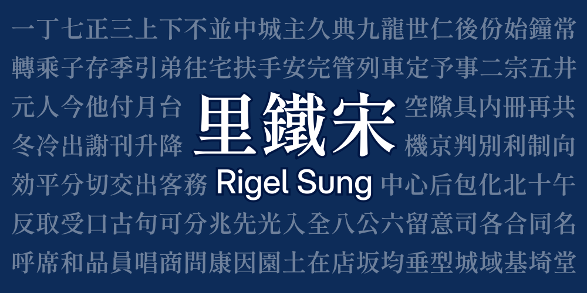

# 里鐵宋 Rigel Sung

This is a CJK typeface based on the [GenRyuMinTW v2.1](https://github.com/ButTaiwan/genryu-font) font (SemiBold variant), designed for use by the Rigel Corporation for in-game wayfinding signages.

Modification including a slightly heavier font weight, and minor modification to the writing of some CJK characters (Such as 天/九/鐘).

2 variant is provided in the `dist/` directory: **Normal** and **Lite** version. The **Lite** version contains most of the commonly used CJK characters (Except Hanja), and are suitable for embedding in applications/web where file size is a concern.

## Note
- This is a hobby project designed for internal use by members of the Rigel Corporation, it is not designed as a professional/versatile font for public use. Outside contributions regarding stylistic changes will not be accepted.
- English font characters remains unchanged, the English font used in the banner image above is **Adwaita Sans**.

## License
This project is licensed under the SIL Open Font License 1.1